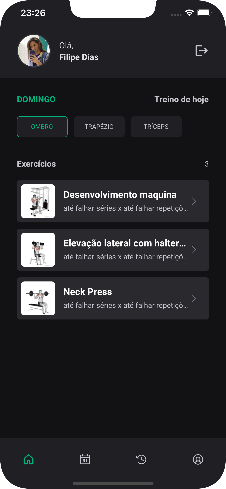
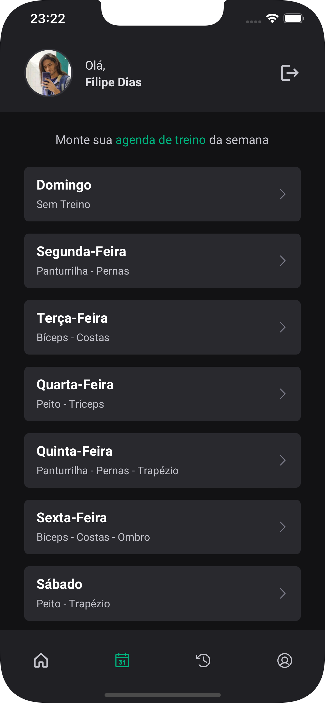
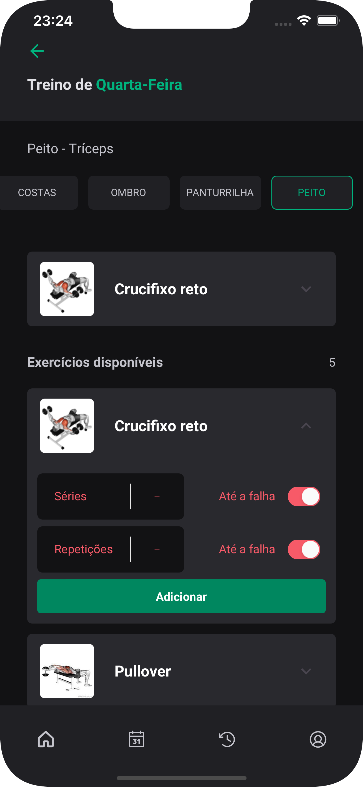
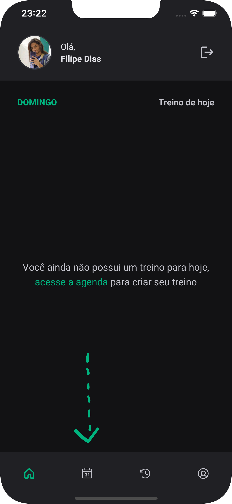
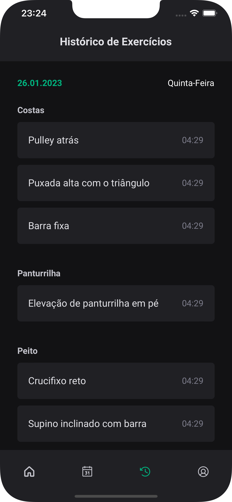
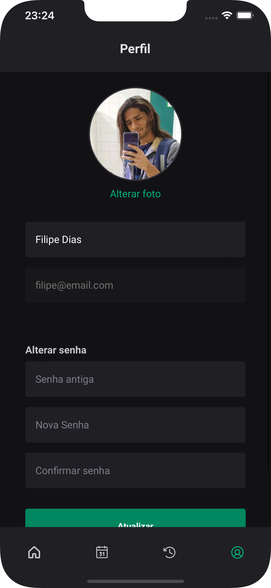

<h1 align="center">
  
</h1>

<h5 align="center">Seu app para treinar na academia, programe seu treino da semana da melhor forma possível.</h5>
<h6 align="center">Caso queira ver um vídeo do app rodando, acesse o link abaixo e deixa a curtida se puder, obg:</h6>
<h6 align="center"><a href="https://www.linkedin.com/posts/filipediaslima_react-reactnative-rocketseat-activity-7025477756087844864--e0_?utm_source=share&utm_medium=member_desktop">IgniteGym App</a></h6>
<br/>

<h2 align="center">
 
 
 
</h2>

<br/>

# :rocket: Techs

* [React Native](https://reactnative.dev/)
* [Expo](https://expo.io/)
* [Native Base](https://nativebase.io/)
* [NodeJS](https://nodejs.org/en/)
* [Sqlite3](https://sqlite.org)
* Typescript

<br/>

# :computer: How to run

```
# Clone do repositório
Faça o clone da aplicação
$ git clone https://github.com/FilipeDiasLima/ignite-gym.git
```

# More

## Rodando o projeto mobile

```
# Para rodar aplicação mobile, será necessário o EXPO

# Navegue até a pasta
$ cd ignite-gym

# Instale as dependencias
$ cd ./mobile && yarn
$ cd ./api && yarn

# Execute o comando
$ cd ./mobile && expo start
$ cd ./api && yarn start
```
<div align="center">
 
 
 
</div>
